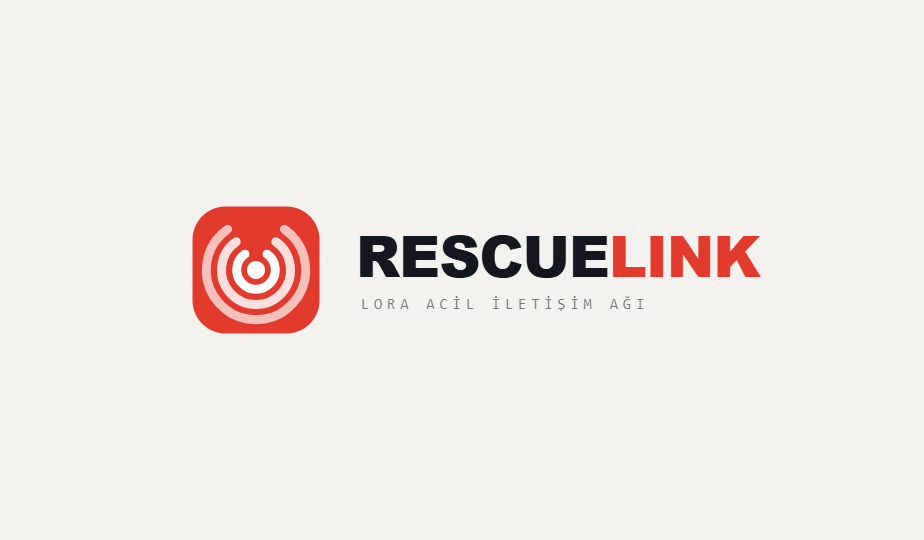

<div align="center">



### Afet anında, internet ve baz istasyonu çökse bile çalışan LoRa tabanlı acil iletişim sistemi

</div>

RescueLink; deprem, yangın ve gaz kaçağı gibi afetlerde afetzededen AFAD karargâhına
ulaşan kesintisiz, düşük güç tüketimli ve otonom bir acil durum kanalı kurar. Sistem,
hücresel şebeke tamamen çökse dahi LoRa mesh ağı üzerinden konum ve durum bilgisini
iletmeye devam eder.

---

## 📌 Öne Çıkanlar

- 📡 **İnternetsiz çalışır** — LoRa mesh ile kilometrelerce menzil, altyapı gerektirmez
- 🧠 **Cihaz-içi yapay zeka** — deprem (ivmeölçer) ve yangın (BME680) tespiti ESP32 üzerinde
- 🔋 **Aşırı düşük güç** — otonom faz geçişleri (Normal → Batarya → Enkaz → Koma) ile pil ömrü maksimize edilir
- 🤖 **Otonom SOS** — afetzede baygın olsa veya telefon ölse bile son bilinen konumla yayın yapar
- 📱 **Mobil entegrasyon** — BLE üzerinden GPS, kişi sayısı ve sağlık durumu zenginleştirmesi
- 🗺️ **Canlı karargâh haritası** — gelen tüm SOS'ler gerçek zamanlı web arayüzünde
- ⬆️ **OTA güncelleme** — WiFi (GitHub) ve BLE üzerinden kablosuz firmware güncelleme

---

## 🏗️ Mimari

RescueLink, her biri tek başına ayakta kalabilen üç katmandan oluşur:

```
 [ Afetzede ] ──BLE──> [ Edge Node (ESP32) ] ──LoRa──> [ Gateway (Raspberry Pi) ] ──> [ Karargâh Haritası ]
                              ▲
                              │ BLE
                       [ Mobil Uygulama ]
```

| Katman | Donanım | Yazılım | Sorumluluk |
|--------|---------|---------|------------|
| **Edge Node** | ESP32 + BME680 + ivmeölçer + LoRa | Arduino/C++, FreeRTOS, Edge Impulse | Sensör, cihaz-içi AI, otonom SOS, LoRa iletim |
| **Gateway** | Raspberry Pi + LoRa alıcı | Python / Flask / SQLite / Socket.IO | Paket çözme, kayıt, canlı harita yayını |
| **Mobil** | Telefon | Flutter (Dart) | GPS/konum, kişi & sağlık bilgisi, arayüz, OTA |

> 📖 Detaylı mimari, protokol ve tasarım kararları için: **[ARCHITECTURE.md](ARCHITECTURE.md)**

---

## 📂 Depo Yapısı

```
RescueLink-System/
├── rescuelink_combined/   # ESP32 firmware (Arduino/C++ + Edge Impulse AI)
├── gateway/               # Raspberry Pi karargâh (Python / Flask)
├── mobile_app/            # Flutter mobil uygulama
├── ARCHITECTURE.md        # Sistem mimarisi ve protokol dokümantasyonu
└── README.md
```

---

## 🚀 Kurulum

### 1. Edge Node (ESP32)

Arduino IDE veya PlatformIO ile derlenir.

**Bağımlılıklar:** `Adafruit_BME680`, `ArduinoJson`, Edge Impulse SDK, ESP32 BLE.

```bash
# 1. Gizli anahtar dosyasını oluştur
cd rescuelink_combined
cp secrets.example.h secrets.h
# 2. secrets.h içine Edge Impulse API anahtarını gir
# 3. NODE_ID'yi her cihaz için ayarla (0x01, 0x02, ...)
# 4. ESP32'ye yükle
```

> ⚠️ `secrets.h` `.gitignore` ile depo dışındadır; **commit etmeyin**.

### 2. Gateway (Raspberry Pi)

```bash
cd gateway
pip install flask flask-socketio pyserial
python init_db.py        # veritabanını oluştur
python app.py            # http://<pi-ip>:5000
```

LoRa alıcı `/dev/ttyAMA0` (9600 baud) üzerinden dinlenir. Canlı harita
`http://<pi-ip>:5000` adresinde açılır.

### 3. Mobil Uygulama (Flutter)

```bash
cd mobile_app
flutter pub get
flutter run
```

---

## 🔌 Protokol Özeti

**LoRa paketi (16 bayt):** `[Header 0x01][Olay][GönderenID][HedefID][SıraNo][TTL][Enlem float][Boylam float][KişiSayısı][Sağlık]`

| Olay Kodu | Anlam |
|-----------|-------|
| `0x00` | Manuel SOS |
| `0x01` | Deprem |
| `0x02` | Yangın |
| `0x03` | Gaz alarmı |
| `0x04` | Enkaz / vuruş |
| `0x12` | Heartbeat |

> Tüm olay kodları, BLE protokolü ve mesh röle mantığı için bkz. [ARCHITECTURE.md](ARCHITECTURE.md).

---

## 👥 Katkı Sağlayanlar

| Katkı | Kişi |
|-------|------|
| Gateway (Raspberry Pi / backend) | Cem Albal |
| Mobil uygulama (Flutter) | Burak Çam |
| Yapay zeka (Edge Impulse modelleri) | Kerem Arkaç |
| Edge Node (ESP32 firmware) | Tüm ekip |

---

## 📋 Sürüm Notları — v1.8.0 "Saha Zekası ve Kesintisiz İletişim"

Bu güncelleme ile Donanım (ESP32 V4.6) ve Yazılım (Flutter V1.8.0) entegrasyonu
"Sıfır Hata, Maksimum Enerji Tasarrufu ve Kesintisiz İletişim" standartlarına ulaştırıldı.

**Donanım (ESP32 Edge Node):**
- LoRa Çakışma Kalkanı (Mutex) ile çift çekirdek yarış durumları çözüldü
- Otonom konum hafızası: telefon kopsa bile son bilinen konumla yayın
- Sliding Window Fire AI: yangın tahmin süresi 4 dk → 5 sn
- 4 fazlı otonom durum makinesi (Normal / Batarya / Enkaz / Koma)
- Z-ekseni odaklı deprem modeli ve özel K-Means anomali algoritması
- Ağ taşkını koruması: 30 sn refrakter (kalkan) süresi
- Enkaz modunda 5'li ritmik vuruş dinleyici

**Mobil Uygulama (Flutter):**
- Arka plan push bildirimleri (uygulama kapalıyken bile ACK ve tehlike uyarıları)
- Canlı BME680 telemetrisi (sıcaklık, nem, basınç, hava kalitesi)
- Memory leak & CPU koruması (StreamSubscription temizliği)
- Sıfır tolerans SOS kilidi (sahte alarm engelleme)
- Watchdog UI: 180 sn kalp atışı gelmezse bağlantı kopuk sayılır
- Kritik batarya "koma" modu (<%15): GPS derin uykuya alınır
